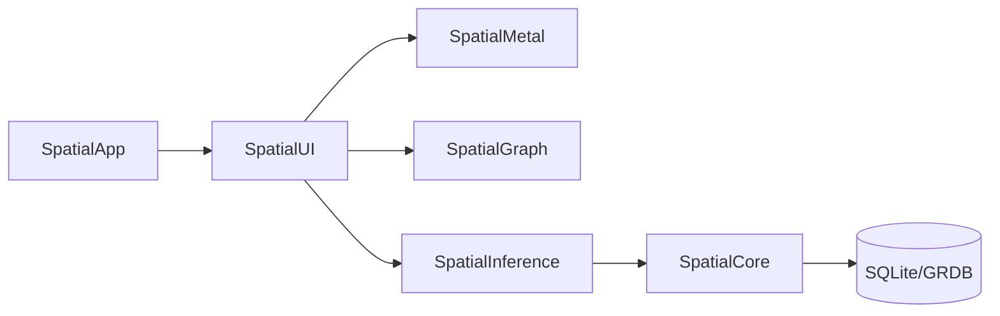

# Spatial

Spatial is a native macOS 14+ filesystem visualizer that renders files as an interactive node graph.

## Architecture

## Modules
- **SpatialCore**: file watching and SQLite persistence schema.
- **SpatialGraph**: node/edge/cluster data model and force-layout engine abstraction.
- **SpatialMetal**: Metal renderer stubs and shader assets for nodes, edges, bloom.
- **SpatialInference**: import parsing and relationship inference orchestration.
- **SpatialUI**: SwiftUI shell with sidebar/canvas/inspector regions.
- **SpatialApp**: application entry point.

## Setup
1. Install Xcode 16 or newer.
2. Open package in Xcode.
3. Build `SpatialApp` for an Apple Silicon macOS 14+ target.
4. Run tests with `swift test`.

## Demo Vault
A synthetic demo vault is provided in `DemoVault/` and can be used as the first indexed root.
